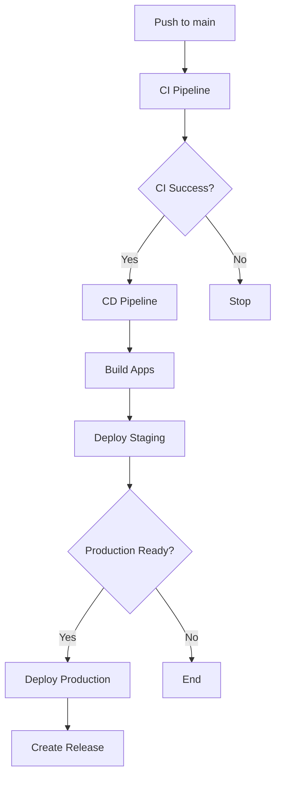

# 🚀 GitHub Actions Workflows

Este projeto utiliza GitHub Actions para automação de CI/CD com workflows para diferentes cenários.

## 📋 Workflows Disponíveis

### 1. 🔍 CI Pipeline (`ci.yml`)

**Trigger**: Push/PR para `main` ou `develop`

**Jobs**:

- **Lint & Type Check**: ESLint, Prettier, TypeScript
- **Expo Doctor**: Validação de configuração Expo
- **Security Audit**: Auditoria de dependências
- **Build Validation**: Validação de build para Android, iOS e Web
- **Summary**: Resumo final do pipeline

### 2. 🚀 CD Pipeline (`cd.yml`)

**Trigger**:

- Push para `main`
- Tags `v*`
- Dispatch manual com opções

**Jobs**:

- **Pre-deployment**: Configuração de ambiente e versão
- **Build Android**: Build simulado para Android
- **Build iOS**: Build simulado para iOS
- **Build Web**: Build simulado para Web
- **Deploy Staging**: Deploy para ambiente de staging
- **Deploy Production**: Deploy para produção
- **Post-deploy**: Resumo e notificações

### 3. 🏷️ Release Management (`release.yml`)

**Trigger**: Dispatch manual

**Features**:

- Versionamento automático (patch/minor/major)
- Atualização de `package.json` e `app.json`
- Geração de changelog
- Criação de tags e releases
- Suporte a pre-releases

## 🎯 Como Usar

### CI Automático

Os workflows de CI são executados automaticamente em:

- Push para `main` ou `develop`
- Pull Requests para essas branches

### Deploy Manual

```bash
# Via interface do GitHub
Actions → CD Pipeline → Run workflow
# Escolher ambiente e plataformas
```

### Criar Release

```bash
# Via interface do GitHub
Actions → Release Management → Run workflow
# Escolher tipo de release (patch/minor/major)
```

## 🔧 Configuração Necessária

### Secrets Requeridos

```bash
EXPO_TOKEN=<seu_expo_token>
EXPO_PROJECT_ID=<seu_project_id>
```

### Environments

- **staging**: https://staging-news-app.example.com
- **production**: https://news-app.example.com

## 📊 Status dos Workflows

| Workflow    | Status                                                                                           | Última Execução |
| ----------- | ------------------------------------------------------------------------------------------------ | --------------- |
| CI Pipeline | [](../../actions/workflows/ci.yml)                | -               |
| CD Pipeline | [](../../actions/workflows/cd.yml)                | -               |
| Release     | [](../../actions/workflows/release.yml) | -               |

## 🎨 Características dos Workflows

### ✅ CI Features

- Validação de código (ESLint + Prettier)
- Type checking (TypeScript)
- Security audit
- Build validation multi-platform
- Matrix builds para Android/iOS/Web

### 🚀 CD Features

- Deploy simulado para múltiplas plataformas
- Ambientes separados (staging/production)
- Artifacts upload/download
- Deploy condicional baseado em triggers
- Logs detalhados com emojis

### 🏷️ Release Features

- Versionamento semântico automático
- Changelog geração automática
- Suporte a pre-releases
- Atualização de versões em múltiplos arquivos
- GitHub releases com notas

## 🔄 Fluxo de Deploy



## 🛠️ Customização

Para adaptar os workflows ao seu projeto:

1. **Ajustar triggers** nos arquivos YAML
2. **Modificar secrets** necessários
3. **Personalizar jobs** de build
4. **Configurar environments** no GitHub
5. **Ajustar URLs** de deploy

## 📝 Logs e Debugging

Os workflows utilizam:

- Emojis para fácil identificação
- Steps detalhados
- Artifacts para builds
- Environment URLs
- Status summaries

## 🎯 Boas Práticas Implementadas

- **Fail Fast**: Falha rápida em erros críticos
- **Matrix Builds**: Builds paralelos
- **Conditional Jobs**: Jobs condicionais
- **Artifact Management**: Gestão de artefatos
- **Environment Protection**: Proteção de ambientes
- **Semantic Versioning**: Versionamento semântico
- **Automated Changelog**: Changelog automático
