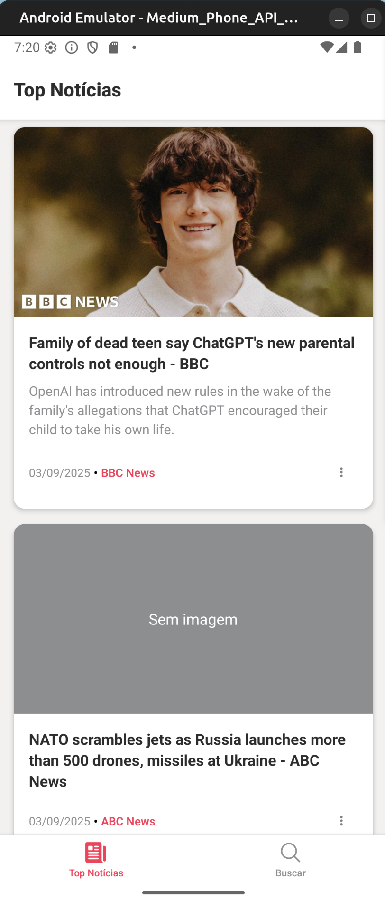
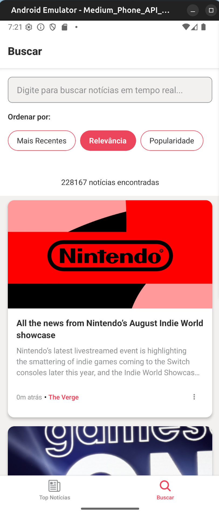

# News App React Native

Aplicativo moderno de notícias desenvolvido com React Native/Expo, implementando arquitetura limpa e padrões avançados de desenvolvimento.

## 📱 Screenshots

<div style="display: flex; gap: 10px;">
  
  
</div>

## 🚀 Como Rodar

#### 1️⃣ Baixar o projeto
```bash
git clone git@github.com:ronaldocutrim/news-app.git
cd news-app
```

#### 2️⃣ Instalar as dependências
```bash
npm install
```

#### 3️⃣ Configurar a chave da API
```bash
# Copiar o arquivo de exemplo
cp .env.example .env
```
Adicionei minha chave ao env example para facilitar, mas se preferir coloque sua chave da News API (você pode criar uma grátis em https://newsapi.org)

#### 4️⃣ Rodar o app
```bash
npm start
```

Depois que rodar, vai aparecer um QR code no terminal. Você pode:
- **No celular**: Baixar o app Expo Go e escanear o QR code
- **Emulador**: Apertar `a` para Android ou `i` para iOS

### Comandos úteis
```bash
npm start       # Roda o app
npm run lint    # Verifica se o código está ok
```

## 📚 Tecnologias e Bibliotecas

### Core Technologies
- **React Native** - Framework mobile multiplataforma
- **Expo** - Plataforma para desenvolvimento React Native
- **TypeScript** - Tipagem estática JavaScript
- **React Navigation** - Navegação entre telas

### Gerenciamento de Estado e Dados
- **@tanstack/react-query** - Cache e sincronização de dados
- **@uidotdev/usehooks** - Hooks utilitários (debounce)

### HTTP e Networking
- **Axios** - Cliente HTTP customizado
- **News API** - Fonte de dados de notícias

### Desenvolvimento e Qualidade
- **ESLint** - Análise estática de código
- **Prettier** - Formatação automática
- **GitHub Actions** - Pipeline de CI automatizado
- **@sentry/react-native** - Monitoramento de erros

### UI/UX
- **@expo/vector-icons** - Ícones vetoriais
- **react-native-paper** - Componentes Material Design

## 🏗️ Arquitetura do Projeto

### Padrão Arquitetural
- **MVVM (Model-View-ViewModel)** com Clean Architecture
- **Dependency Injection** nos services
- **Hook-level Decoupling** para componentes reutilizáveis
- **Service Layer** separando lógica de negócio da apresentação

### Estrutura de Pastas
```
src/
├── core/                    # Módulos de domínio
│   ├── feed/               # Domínio do feed de notícias
│   ├── search/             # Domínio de busca
│   ├── news-detail/        # Domínio de detalhes
├── components/             # Componentes UI reutilizáveis
├── hooks/                  # Custom hooks específicos
├── utils/                  # Utilitários e configurações
└── contracts/              # Interfaces e tipos globais
```

### NewsCard - Padrão de Desacoplamento por Contexto

**Problema Resolvido**: Um componente visual com comportamentos diferentes por contexto.

**Solução**: Hook-level decoupling
- 🎯 **1 Componente Visual**: `NewsCard.tsx`
- 🎯 **1 Interface**: `NewsCardProps.ts`  
- 🎯 **N Hooks por Contexto**: `useFeedNewsCard`, `useSearchNewsCard`

**Benefícios**:
- Zero duplicação de código visual
- Fácil extensão para novos contextos
- Formatação específica (data relativa vs padrão)
- Analytics diferenciado por contexto

## 🚧 Melhorias Futuras
- [ ] **Design System** - Componentes reutilizáveis e estilização
- [ ] **Desacoplamento de Recursos** - Inverter a dependência entre componentes para aumentar testabilidade.
- [ ] **CD Pipeline** - Deploy automático com GitHub Actions
- [ ] **Testing** - Implementar testes unitários, integração e E2E
- [ ] **Performance Optimization** - Code splitting, otimização de imagens e bundle
